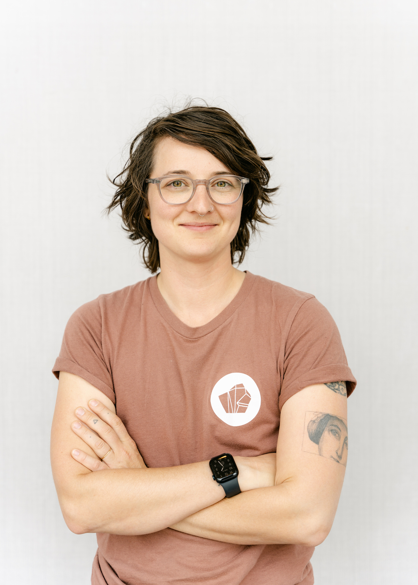

Hello! I'm Noelle, a staff software engineer residing in Portland, OR, where I spend my days leading a frontend engineering team at [HashiCorp](https://www.hashicorp.com/). I'm excited about thoughtful UX/UI design and get a thrill from the challenge of turning chaos into beautiful organization.

My approach to building and designing software is influenced by my varied experiences working in tech over the last decade. As a staff frontend engineer I currently focus on balancing product and design needs, building an organized, reliable UI while helping my teammates grow. In previous roles in community management I advocated for better UIs and APIs and built relationships. My undergraduate degree in sociology equipped me with research methods, systems thinking and a passion for understanding human behavior.  All of these experiences led me to a love of UX.

I'm dedicated to building a more empathetic, human-centered tech industry, which I occasionally [speak](http://opensourcebridge.org/sessions/1763), [write](/blog/), and [rant](https://youtu.be/Eg8-tf7VFuQ) about. In my free time I'm often organizing community bike rides for women, trans, and non-binary folks. When I'm not on my bike I'm usually running around outside or scheming up my next big [travel adventure](https://drive.google.com/open?id=1muxaKlQ9ndnV7dptPwHesS8o89w&usp=sharing).
